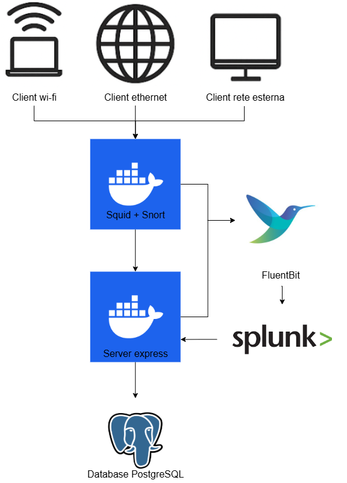
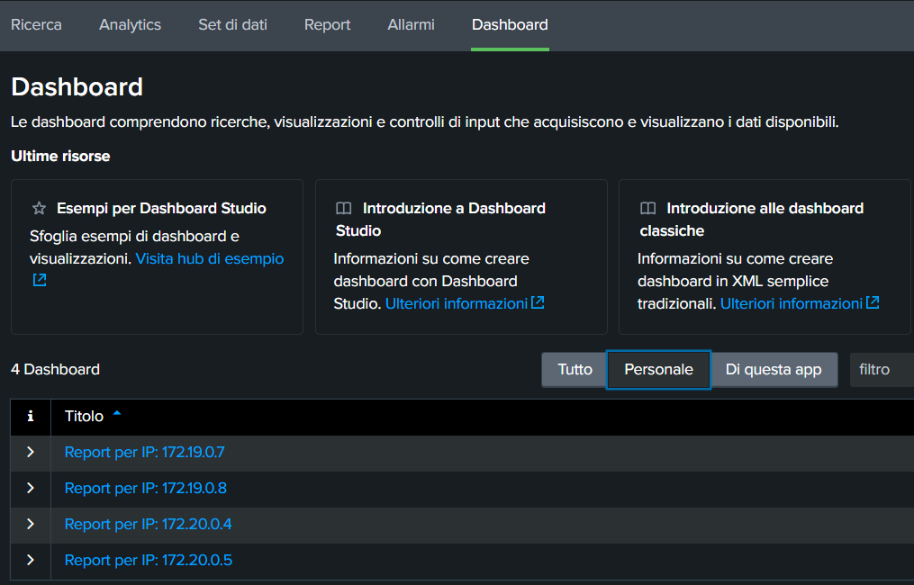
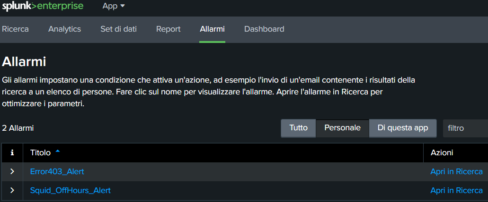
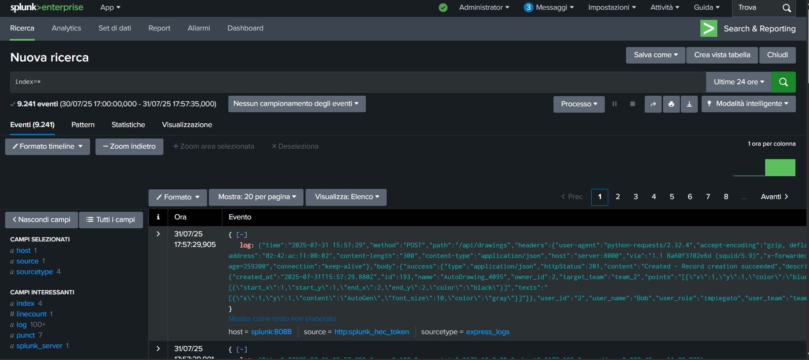

# ZeroNote

<div align="center">
  <p align="center">
    
  </p>

  <p>
    Corso di Advanced CyberSecurity 2024/2025 <br/>
    <strong>Progetto: Realizzazione di un'architettura Zero Trust</strong>
  </p>

  <br/>

  <p><strong>Powered by:</strong></p>
  <br/>
  <p>
    <a href="https://www.docker.com/"></a>
    <a href="https://www.postgresql.org/"></a>
    <a href="https://expressjs.com/"></a>
    <a href="https://nodejs.org/"></a>
    <a href="https://www.typescriptlang.org/"></a>
    <a href="https://sequelize.org/"></a>
    <a href="https://www.npmjs.com/"></a>
    <a href="https://www.python.org/"></a>
    <a href="https://www.splunk.com/"></a>
    <a href="http://www.squid-cache.org/"></a>
    <a href="https://www.snort.org/"></a>
    <a href="https://fluentbit.io/"></a>
  </p>

</div>

## Tabella dei contenuti
- [ZeroNote](#zeronote)
  - [Tabella dei contenuti](#tabella-dei-contenuti)
  - [Introduzione e specifiche progetto](#introduzione-e-specifiche-progetto)
  - [Infrastruttura del progetto](#infrastruttura-del-progetto)
    - [Composizione dell'Infrastruttura](#composizione-dellinfrastruttura)
    - [Architettura Zero Trust](#architettura-zero-trust)
  - [Policy implementate](#policy-implementate)
    - [Score di fiducia](#score-di-fiducia)
    - [Policy che analizzano la richiesta](#policy-che-analizzano-la-richiesta)
    - [Policy che analizzano il metodo ed i permessi](#policy-che-analizzano-il-metodo-ed-i-permessi)
  - [Installazione](#installazione)
  - [Avvio](#avvio)
    - [Comportamento dei client](#comportamento-dei-client)
  - [Autori](#autori)
  
## Introduzione e specifiche progetto
ZeroNote realizza un'infrastruttura di sicurezza informatica per un sistema di gestione collaborativa di disegni ispirato ai taccuini digitali (come OneNote), progettato secondo i principi dell’architettura Zero Trust.  
Ogni richiesta di accesso, proveniente da manager, dipendenti e consulenti attraverso dispositivi su reti aziendali o da reti esterne, è sottoposta a controlli rigorosi e contestuali di autenticazione, autorizzazione e ispezione, indipendentemente dalla posizione del client. Pertanto ogni richiesta verrà trattata come potenzialmente non affidabile e soggetta agli stessi controlli delle altre.  
L’architettura, orchestrata con Docker, simula scenari d’uso reali tramite client containerizzati che inviano richieste REST (GET/POST/PUT/DELETE) verso un server Express, che funge sia da Policy Decision Point (PDP) che da Policy Enforcement Point (PEP).  

Per rafforzare la fiducia e monitorare le attività:
- Squid agisce come proxy filtrante di rete;
- Snort intercetta comportamenti sospetti come IDS;
- Splunk raccoglie log da tutti i container e risponde alle query del server aggiornando lo score di fiducia in tempo reale.

Il modello di controllo accessi è basato su MAC/RBAC: ogni utente è assegnato a un team e a un ruolo (Manager, Impiegato, Consulente), con permessi progressivi e controlli su ruolo, team, orario e rete di origine.

L’intera infrastruttura garantisce un flusso controllato e verificabile delle richieste, centralizzando le policy senza rinunciare alla flessibilità, in linea con i principi Zero Trust.

## Infrastruttura del progetto
<div align="center">
  
</div>

**ZeroNote** implementa un'infrastruttura **Zero Trust** per garantire che ogni richiesta, indipendentemente dalla provenienza del client (sia che provenga da una rete aziendale, da un dispositivo Wi-Fi o da una rete esterna), venga autenticata, autorizzata e monitorata rigorosamente.

### Composizione dell'Infrastruttura

L'infrastruttura è composta da vari servizi che lavorano insieme per garantire un alto livello di sicurezza e protezione dei dati:

1. **Client Dockerizzati**:
   - Quattro client, sviluppati in **Python**, sono contenitori Dockerizzati che simulano diverse operazioni (GET, POST, PUT, DELETE). Ogni client rappresenta un tipo di utente con permessi differenti (es. dipendente in sede, dipendente con dispositivo Wi-Fi aziendale, consulente in sede).
   - I client inviano richieste al **proxy Squid**, che intercetta i pacchetti prima di inoltrarli al **server Express**.

2. **Squid Proxy**:
   - Funziona come **forward proxy** e come primo filtro di rete, applicando politiche di sicurezza per richieste provenienti da reti non aziendali o da indirizzi IP fuori range.
   - Squid raccoglie e registra i log, che vengono inviati a **Splunk** tramite **Fluentbit** per una successiva analisi. All'interno del log è inoltre indicato se la richiesta viene effettuata fuori dall'orario di lavoro.

3. **Snort IDS (Intrusion Detection System)**:
   - Snort è configurato per sniffare il traffico che passa attraverso il **proxy Squid**, monitorando tutte le richieste in transito. 
   - Rileva inoltre attività sospette riconducibili a tentativi di attacchi DoS.

4. **Fluentbit**:
  - **Fluentbit** è utilizzato per raccogliere i log generati da **Squid**, **Snort** e dal **server Express**, per poi inviarli a **Splunk** per l'analisi centralizzata.
  - Fluentbit legge i log dai file di accesso e di errore di Squid, dai log di Snort riguardanti gli attacchi di rete e dai log generati dal server Express. Questi log vengono quindi inviati a Splunk con le rispettive etichette per ogni tipo di log, come `squid.access`, `snort.alert`, `express_logs`, e `score_logs` per facilitare l'organizzazione e la ricerca dei dati.

5. **Server Express**:
   - Il server **Express** implementa vari **middleware** per la gestione del calcolo dello **score di fiducia** per ogni richiesta. Questi middleware includono:
     - **scoreInitMiddleware**: inizializza lo score per ogni richiesta.
     - **scoreTrustAnalysisMiddleware**: modifica lo score in base all'analisi della fiducia, considerando attività precedenti da parte dell'IP, subnet e MAC address.
     - **scoreTrustNetworkAnalysisMiddleware**: modifica lo score in base alla rete di provenienza della richiesta (interna, esterna, Wi-Fi).
     - **scoreOutsideWorkHours**: penalizza le richieste fatte fuori dall'orario lavorativo.
     - **scoreTrustDosAnalysisMiddleware**: penalizza le richieste che sembrano far parte di un attacco DDoS.
     - Middleware specifici per le rotte CRUD, dove viene analizzato se le richieste sono ben formate, il ruolo dell'utente e se ha il permesso di eseguire l'azione richiesta.

6. **Splunk**:
   - **Splunk** raccoglie e analizza i log provenienti dai vari componenti (Squid, Snort, Server Express), consentendo la visualizzazione in tempo reale degli eventi e dei dati relativi alle attività del sistema.
   - All'interno di Splunk è implementato anche un **dashboard interattivo** che visualizza informazioni dettagliate sulle richieste, sullo score di fiducia, e sugli accessi alle risorse.

7. **Database PostgreSQL**:
   - Il sistema si avvale di un database **PostgreSQL** per gestire i dati persistenti e le informazioni relative agli utenti e alle risorse (Drawings). I dati vengono memorizzati e recuperati attraverso il **server Express** utilizzando il **Sequelize ORM**.

### Architettura Zero Trust

Tutti i componenti della rete aziendale, siano essi interni o esterni, sono monitorati e controllati secondo i principi **Zero Trust**, dove ogni richiesta è **sospetta fino a prova contraria**. Questo approccio garantisce che le risorse siano accessibili solo a utenti autenticati e autorizzati, e che ogni accesso sia monitorato e registrato in tempo reale.

1. **Controllo Accessi**:
   - Le **policy di accesso** sono definite tramite un modello **RBAC (Role-Based Access Control)** e **MAC (Mandatory Access Control)**. Gli utenti sono classificati in base ai loro **ruoli** e **team**, e i permessi sono assegnati in base al tipo di risorsa e alle operazioni che l'utente è autorizzato a compiere.

2. **Controlli di Sicurezza in Tempo Reale (PDP e PEP)**:
   - Ogni richiesta di accesso alle risorse è sottoposta a controlli di **autenticazione**, **autorizzazione** e **monitoraggio** in tempo reale. L'**analisi della fiducia** modifica dinamicamente lo **score di fiducia** di ogni richiesta, penalizzando richieste da reti non sicure o provenienti da IP con un comportamento sospetto.
   - Le richieste il cui punteggio è basso (<40) verranno bloccate.

## Policy implementate

### Score di fiducia

Ad ogni richiesta, al suo arrivo sul server express, viene assegnato uno score di fiducia.  
Tale punteggio parte sempre da 50 punti e può arrivare ad un minimo di 1 fino ad un massimo di 100.

### Policy che analizzano la richiesta

1. **Controllo sulla fascia oraria di lavoro**  
  Questa policy applica una penalità se il client effettua un numero significativo di richieste fuori dall'orario lavorativo standard (08:00–20:00). Ogni 10 richieste fuori orario, lo score del client viene ridotto di 0,5, con una penalità massima di 10.
 
2. **Rifiuto delle richieste degli ip bloccati**  
  - Le richieste effettuate dagli ip inseriti all'interno di una **blocklist** sono bloccate e ignorate.
  - Le richieste provenienti da ip sconosciuti sono bloccati da Squid.
 
3. **Penalità per richieste effettuate da reti diverse dalla rete ethernet o wi-fi aziendali**  
  - Le richieste effettuate dalla rete wifi aziendale (172.20.0.0/16) abbassano lo score di fiducia di 5 punti.
  - Le richieste effettuate da reti esterne (172.18.0.0/16 oppure 172.24.0.0/16) abbassano lo score di fiducia di 10 punti.

4. **Bonus al punteggio per richieste da rete ethernet aziendale**  
  Le richieste effettuate dalla rete cablata aziendale (172.19.0.0/16) applica un bonus allo score di fiducia di 10 punti.
 
5. **Troppe richieste in poco tempo abbassano lo score di fiducia per sospetto attacco DoS**  
  Viene analizzata la media del tempo tra una richiesta e l'altra delle ultime 25 richieste, se è più bassa di 10 secondi penalizza il punteggio di 10 punti.
 
6. **Penalità per gli IP che fanno molte richieste che non vanno a buon fine**  
  Viene analizzato il numero di richieste non andate a buon fine delle ultime 25 richieste:
  - Se le richieste con errori superano il 75% del totale, il punteggio viene penalizzato di 10 punti.
  - Se le richieste con errori superano il 50% del totale, il punteggio viene penalizzato di 5 punti.
  - Se le richieste con errori superano il 25% del totale, vengono aggiunti 5 punti allo score di fiducia.
  - Se le richieste con errori sono inferiori al 25% del totale, vengono aggiunti 10 punti allo score di fiducia.

### Policy che analizzano il metodo ed i permessi
All'interno di un team ci sono tre diversi tipi di utente: Manager, impiegato e consulente.  
Le risorse sono "drawings" per la quale sono definiti: il proprietario, il team in cui sono pubblicate e il suo contenuto.
**Manager**: può visualizzare, creare, cancellare e modificare tutte le risorse all'interno del suo team. Inoltre può creare una risorsa all'interno di un altro team, per la quale ha tutti i permessi. 
**Impiegato**: può visualizzare, creare e modificare tutte le risorse all'interno del suo solo team ma non può cancellarle. 
**Consulente**: può visualizzare le risorse di tutti i team. 

7. **GET concesso a tutti i ruoli**  
  Tutti gli utenti autenticati possono fare una richiesta GET su una risorsa, purchè il loro score di fiducia sia sufficientemente alta.
 
8. **Penalità per richieste malformate**  
  Le richieste malformate (es. lunghezza della stringa del nome del Drawing più lunga di 255 caratteri) verranno bloccate. Inoltre lo score di fiducia sarà penalizzato di 5 punti.
 
9.  **Gli utenti appartenenti ad un team non possono modificare risorse di altri team**  
  - Gli utenti consulente ed impiegato non possono modificare, creare o cancellare risorse degli altri team.
  - L'utente manager non può modificare o cancellare risorse di altri team, tranne se la risorsa appartiene a lui.
 
10.  **Un consulente non può modificare o cancellare risorse del proprio team**  
  Il ruolo di consulente non consente altre operazioni oltre alla visualizzazione del contenuto delle risorse dei vari team.
 
11.  **Un manager può creare risorse in team diversi dal suo**  
  Il ruolo di manager consente la creazione di risorse in team diversi dal proprio.

## Installazione
Per installare e avviare correttamente l'applicazione, segui i seguenti passaggi:
 
1. **Clona il repository**
```bash
   git clone https://github.com/simgian0/Progetto-Cyber-Security.git
   cd Progetto-Cyber-Security
```


2. **Configura il file .env**:
Nel progetto, crea un file .env nella root directory del progetto. Il file .env contiene tutte le variabili di ambiente necessarie per configurare il database, il server e Splunk.
Esempio di file .env:
```bash
# Database Configuration
POSTGRES_USER=user
POSTGRES_PASSWORD=password
POSTGRES_PORT=5432
POSTGRES_DB=mydb
POSTGRES_HOST=db
 
# Server Configuration
PORT=8000 # Porta su cui il server Express sarà in ascolto
 
# Splunk Configuration
SPLUNK_BASE_URL=https://splunk:8089
SPLUNK_USERNAME=admin
SPLUNK_PASSWORD=Chang3d!
```
**Descrizione delle variabili**:
 
**POSTGRES_USER**: Nome utente del database PostgreSQL.
 
**POSTGRES_PASSWORD**: Password per l'utente del database.
 
**POSTGRES_PORT**: Porta su cui il database PostgreSQL è in ascolto (di default 5432).
 
**POSTGRES_DB**: Nome del database da utilizzare.
 
**POSTGRES_HOST**: Indirizzo del servizio del database (generalmente il nome del container o IP).
 
**PORT**: La porta su cui il server Express risponde (default: 8000).
 
**SPLUNK_BASE_URL**: URL di accesso alla tua istanza Splunk (dove è eseguito Splunk).
 
**SPLUNK_USERNAME e SPLUNK_PASSWORD**: Credenziali di accesso per Splunk.
 

3. **Esecuzione applicazione**:
Una volta configurato il file .env, si può avviare il progetto.  
Con Docker installato, esegui il seguente comando all'interno della root del progetto:
```bash
docker-compose up --build
```
 
Questo comando costruirà e avvierà tutti i servizi necessari, tra cui il database PostgreSQL, il server Express, Squid, Snort e Splunk.
 

4. **Accesso al servizio**:
Una volta che tutti i container sono attivi, i client iniziano ad operare autonomamente inviando richieste GET, POST, PUT e DELETE al server.   
Puoi visualizzare i log inviati dai vari servizi a Splunk tramite:
 
- **Splunk GUI**: http://localhost:18100 (login con le credenziali configurate nel .env)

## Avvio
Per consentire il corretto funzionamento di Splunk, dopo l'avvio dei container, è necessario eseguire le seguenti operazioni:
- Attendere che si avvi la GUI di Splunk al seguente URL -> "http://localhost:18100/it-IT/"
- Accedere con le credenziali presenti nel file .env
- Inserire gli indici :
  - Andare su Impostazioni -> Indici -> Nuovo Indice
  - Inserire nel campo "Nome indice" il nome dei seguenti indici e poi salvare:
    - express
    - snort
    - score
    - squid
  - Effettuare questa operazione per ogni indice.
- Disabilitare SSL:
  - Andare su Impostazioni -> Input Dati -> Raccolta eventi HTTP o HTTPS -> Impostazioni Globali
  - Togliere la spunta "Abilita SSL" e salvare
 

**Dashboard**  
Al momento dell'avvio verranno effettuato delle API a Splunk per la creazione di Dashboard relative ai vari client.
Queste saranno visualizzabili accedendo all'app "Search and Reporting" -> Dashboard
<div align="center">
  
</div>
 

**Alert**  
Allo stesso modo delle dashboard, verranno fatte delle chiamate API a Splunk per la creazione di alcuni alert.
Questi alert andranno a analizzare i log ricevuti a Splunk e creare degli allarmi nel momento in cui certe condizioni si verificano.
Anche questi saranno visualizzabili all'interno dell'app "Search and Reporting" alla voce Allarmi
<div align="center">
  
</div>


**Search**  
All'interno dell'app "Search and Reporting" alla voce "Ricerca" è possibile lanciare delle SPL query. Utili per effettuare delle rapide ricerce, analizzare log salvati nei vari indici ed eseguire operazioni statistiche semplici.
<div align="center">
  
</div>


### Comportamento dei client

I client sono stati configurati per il test con i seguenti comportamenti:

- **Client 1 e Client 2**: Appartenenti alla rete **ethernet aziendale**, compiono principalmente azioni che tendono ad **aumentare il punteggio** sia proprio che della **subnet**. Questi client generano richieste che favoriscono l'incremento della fiducia, come operazioni di lettura e scrittura consentite all'interno della rete aziendale.

- **Client 3 e Client 4**: Appartenenti alla rete **Wi-Fi aziendale**, compiono principalmente azioni che tendono a **ridurre il punteggio** proprio e della **subnet**. Questi client generano richieste che abbassano il punteggio a causa di operazioni sbagliate e in reti meno sicure. Pertanto, alcune richieste che potrebbero andare a buon fine, a causa del basso punteggio, verranno poi **bloccate dall'enforcer**.


## Autori
Giano Simone - s1116146@studenti.univpm.it
 
Paolucci Federico - s1116751@studenti.univpm.it
 
Pace Elisa - s1120024@studenti.univpm.it
 
Incipini Marco - s1115924@studenti.univpm.it
 
Sardellini Enrico Maria - s1120355@studenti.univpm.it