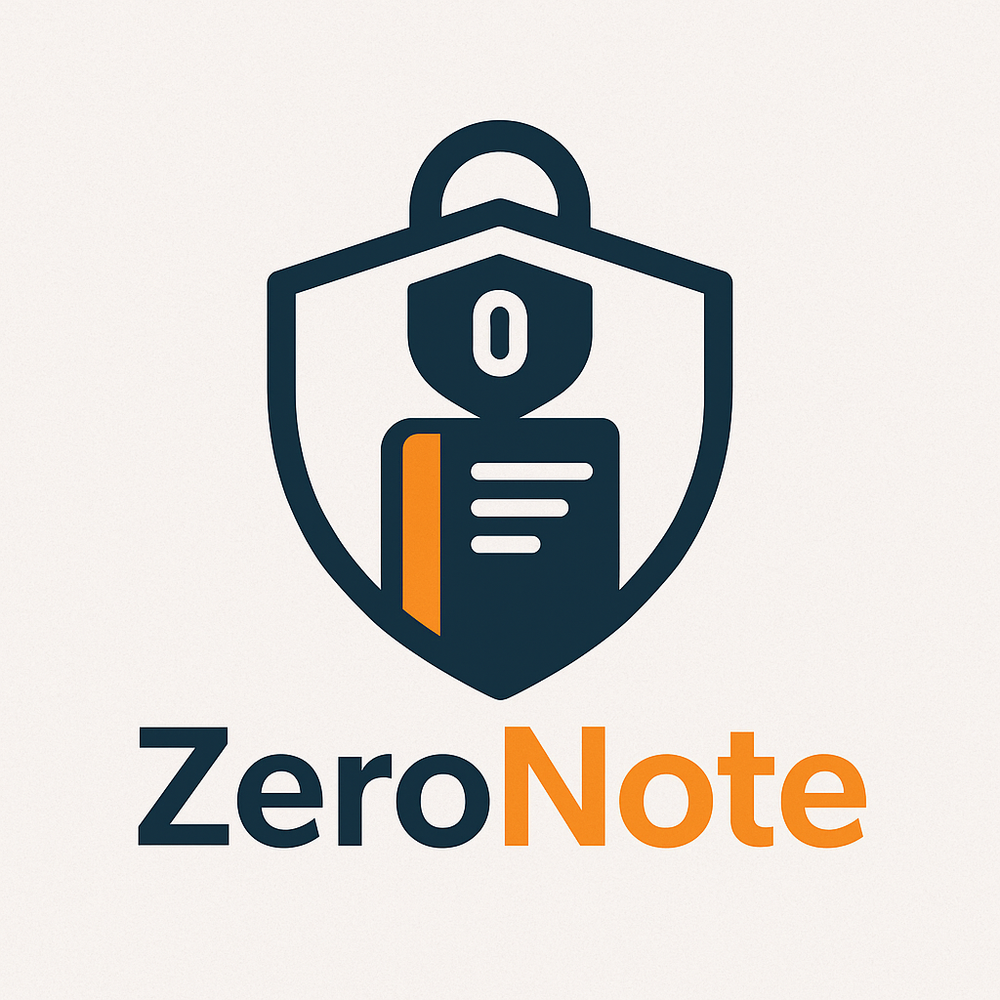

# ZeroNote

  

    
  

  

    Corso di Advanced CyberSecurity 2024/2025  
    <strong>Progetto: Realizzazione di un'architettura Zero Trust</strong>
  

   

  
<strong>Realizzato con:</strong>

   
  

    
    
    
    
    
    
    
    
    
    
    
    
  

## Tabella dei contenuti

## Introduzione e specifiche progetto

## Installazione

## Infrastrutture e configurazione

## Autori

